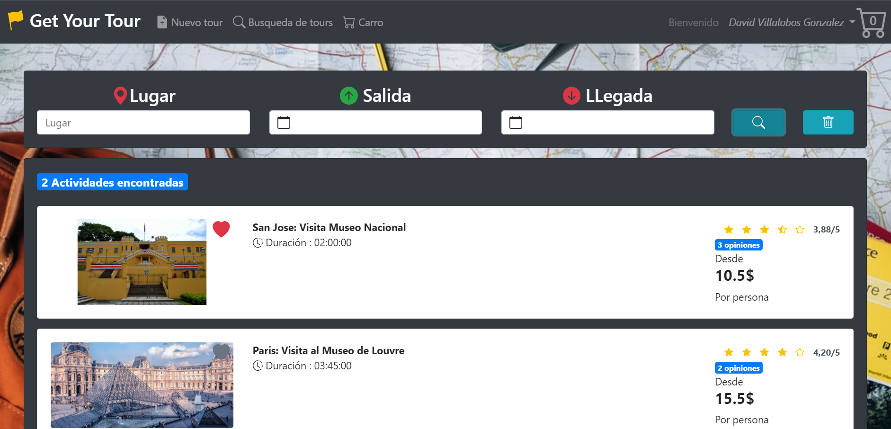

# Tours Online  
 
Aplicación de gestión de reservas de excursiones
La aplicación se realizo con java y spring boot en el backend y la interfaz fue hecha con vue y vue-bootstrap, el gestor de base de datos es SQL Server. 

  

## Construido con
*	[SQL Server](https://www.microsoft.com/es-es/sql-server/sql-server-downloads)
*	[Java15](https://www.oracle.com/java/technologies/javase/jdk15-archive-downloads.html)
*	[SpringBoot](https://spring.io/projects/spring-boot)
*	[Vue2](https://vuejs.org/)
*	[Boostrap-Vue](https://bootstrap-vue.org/docs)

## Notas
Para ejecutar la aplicación debe iniciar ambos servidores, ambos el backend y el frontend. También debe implementar la base de datos.

## Base de datos (SQL Server)

Para crear la base de datos, abra una sesión desde sqlserver y ejecute el script que genera el modelo, lo puede encontrar en la siguiente ruta:   
` tours-online/backend/database/CreateModel.sql` 

Una vez creado el modelo debe agregar los procedimientos y funciones las cuales se encuentran en la siguiente ruta:  
` tours-online/backend/database/FunctionsAndProcedures.sql `

Y si asi lo desea puede ingresar los siguientes datos de prueba   
` tours-online/backend/database/Data.sql`

Tome en cuenta que las imagenes que se van a insertar se encuentran en la carpeta:  
 ` tours-online/backend/database/img `    
Pero debera moverlas a `C:\img` esto debido a permisos de usuario.
La base de datos esta lista!

## Backend
Primeramente debe cambiar las credenciales de acceso a la base de datos, desde el archivo:  
`tours-online/backend/src/main/java/com/getyourtour/dao/ConnectionDB.java`  
Cambie el servidor, el usuario y la contraseña.   
Segundo debe cambiar las credenciales del servicio de correo electronico desde el archivo:
`tours_online\backend\src\main\java\com\getyourtour\service\EmailServiceImpl.java`
Cambie el email y el TOKEN, debera crear uno desde el correo de gmail.
Ahora procesa a construir el proyecto, ejecutando el archivo:  
` tours_online\backend\build.bat`  
Ademas de generar el .jar realizar un test de conexion para verificar que la base de datos funciona correctamente.
Una vez que la construccion es exitosa finalmente ya puede iniciar el backend.
Para ello debe ejecutar el archivo:  ` tours_online\backend\run.bat`    
Abra una pestaña del navegador en la direccion: `http://localhost:8001 `    
Debera visualizar un mensaje como el siguiente: ` RestFul Api of App GetYourTours `    

De ser asi el backend esta funcionando perfectamente, puede hacer otras solicitudes como:  

*	Lista de paises: `http://localhost:8001/countries `  
*	Lista de usuarios: `http://localhost:8001/users `  
*	Tour con el id 1: `http://localhost:8001/tours?id=1 `    
Cabe recalcar que la informacion que se muestra es la que esta registrada en la base de datos.  

## Frontend

Primeramente deberá instalar las dependencias del proyecto desde la carpeta   ` tours_online\frontend `  abra una terminal y ejecute el comando    ` npm install `   
Seguido debe construir el proyecto ejecutando el archivo: ` tours_online\frontend\build.bat `  

Una vez que la construccion es exitosa finalmente ya puede iniciar el backend, ejecutando el archivo: ` tours_online\frontend\run.bat`  
Abra una pestaña del navegador en la direccion: `http://localhost:8002 ` 

Y listo ya podra utilizar la aplicacion

## Autor
*   [DavidVillalobos](https://github.com/DavidVillalobos)

